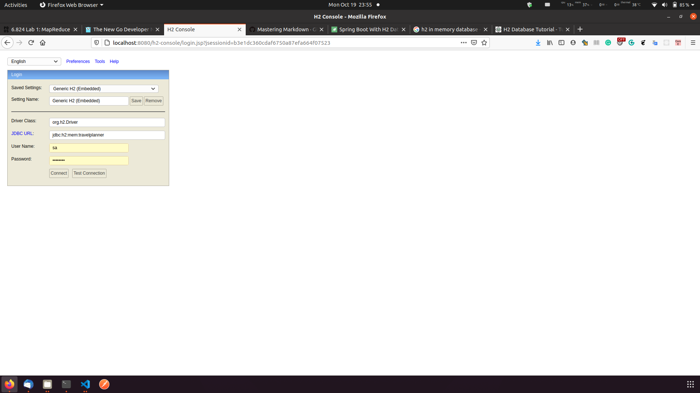

1. change database from mysql to h2 embedded
2. database link: http://localhost:8080/h2-console/

3. I disabled register/login since we don't have authorization server currently.
4. you need apply a Google Map API key to use our service(src/main/java/team6/travelplanner/Constants.java), this api key is expired.
5. 
use 
```
  mvn install  
  mvn spring-boot:run
```
to start server
